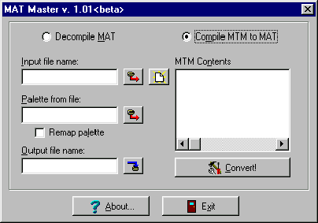
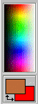
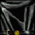
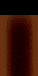
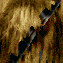

Author:Skin Making Tutorial

-----

Author: [Admiral Thrawn](mailto:thrawn_18@hotmail.com)  
  
So, you wanna make a skin eh? Well I will tell you some basics on making
a new skin. Here is what you need.  
A Gob program from www.darkjedi.com (I prefer ConMan)  
Mat Master from www.darkjedi.com  
The JK.PAL from massassi.jedinights.com in the MISC section  
Paint Shop Pro or any other photo editor. I prefer Paint Shop Pro -
www.jasc.com for a 30 day trial.  
  
1.)Open up your Gob program and open the res2.gob. Either in the JK
directory or on the CD under Gamedata/Resource and click and extract a
3do you want to edit.  
  
2.)Open up the 3do to find the mats you want to edit then in ConMan
click Mat under 3do and extract the mats.  
  
3.)Open Mat Master  
  
  
  
Click Palette from file: and it will give you the open window. Open
unicolor.cmp. If you are editing a Dark Jedi, use the cmp from that
level. Such as Maw. Use the CMP 15maw.cmp or for Sarriss 17sarris.cmp BE
SURE IT SAYS DECOMPILE MATand not COMPILE MTM TO MAT  
  
4.)Click Input file name: and find the mat you want to change to a bmp.
Click on that and then click on the folder next to the Input file name.
You just coverted the mat to a bmp. Repeat this until ALL the mats are
bmps.  
  
5.)Open PSP or your paint editor. Basic Windows Paint will not work. As
soon as your BMP is opened, click color and load palette and click
JK.PAL. This will give you a 256 color palette. JK only has 256 colors
in the game. If you do not use the jk.pal then you will not be able to
get the bmp back into a mat. Now, this part use to make me mad until I
thought of why it did that. I found a specific shade in PSP like the
number (just making this number up) 25, 34, 17. Well I got 15, 17, 10 as
my shade. Because in JK that color does not exist. 0, 0, 0 is black and
it makes the color transparent. 255, 255, 255 is white.  
  
  
  
This is your 256 palatte. Now once you found your color, select your
brush and color over the skin however you want to.  
  
  
  
These pictures are from Al MacDonald's tutorial. I suggest you read it.
Anyway, look how there is black on those. That is because it is
transparent there. Cool huh?  
  
Here are some more pics he did. Note the detail on the cloth  
  
  
  
  
  
  
  
Wookie Hair  
  
  
  
  
  
By this time you should notice all the faces are smeared. That is
because the face seen above wraps around to a part of the side. Now
after you finished your BMP open up Mat Master again.  
  
  
  
Load your Palette and this time click on COMPILE MTM TO MAT. When this
opens, click the arrow box at the bottom and select BMP and change BMPs
back to mats. NOW this is the strange part. The mat will go from
kyface3.mat to kyface3-0.mat. Just rename it by removing the -0 part.
Delete the original mats and the MTM. I usually do that before I change
the BMP into a mat.  
  
Now, open the models.dat and add the 3do to the bottom and update the
number at the top by adding one number. So if your number is 120 (you
got BFP2) then update it to 121.  
  
Ok. Now you are telling me you do not want it to COVER any skin right?
That is normal. Just rename the mats whatever you want to and do the
same in the 3do. So if you take kyface1.mat and name it lukeface1.mat
open the 3do and do the same or it will look for the kyface1.mat.  
  
Next Gob your project OR make a folder in the JK RESOURCE DIRECTORY and
name in 3do and put your new 3do in there. Then in the 3do folder make
one called MAT and put the mats in there. ONLY the mats that came from
ConMan under 3do. There are 2 mat listings. If you do a lightsaber, then
put that in the Resource folder under MAT and not under 3do/mat  
  
Ok. Here is a cool one. You want to take Boba Fett's head, put it on Jan
Ors body and give it a Stormtroopers legs and Jerecs arms? Fine. Just
open the 3do (any of them) and say for Fett's head it is fettface.mat
inside the Jan 3do put that in janface.mat. So it becomes fettface.mat
instead of janface.mat. Follow that with the arms and legs and so on.  
  
One last thing. If you PAINT any mats. EVERYONE in the MP game must have
that skin to see it. If you have any problems e-mail me at
thrawn\_18@hotmail.com and I'll see what I can do. I do NOT however make
skins for people. Though sometimes I make exceptions. To get Al
MacDonald's Tutorial go to  
http://209.1.245.15/3do/swskins.htm  
It is under QUICK DOWNLOADS  
  
  

© Copyright 1998 [Admiral Thrawn](mailto:thrawn_18@hotmail.com) and [The
Massassi Temple](http://massassi.jedinights.com/).
