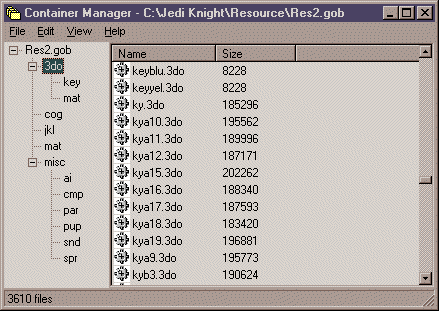
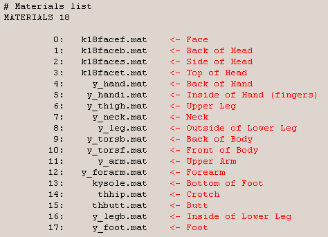
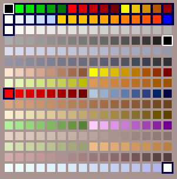
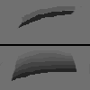
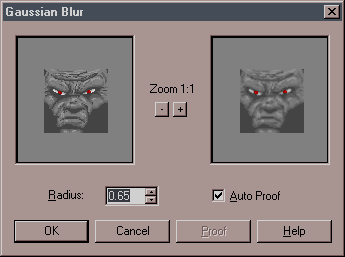
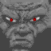
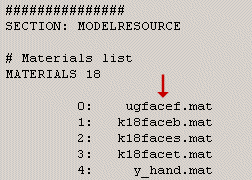
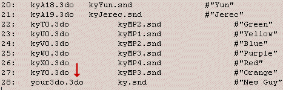
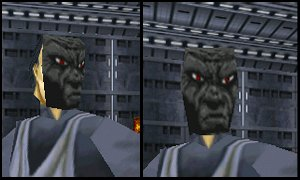

Author: How
to Make Skins  

-----

Author: [CosmoDNA](mailto:cosmodna@hotmail.com)  
  

Let's take a look at how to make your own skins for Jedi Knight. Like
all tutorials, it's pretty easy. ;)

**These are the files you'll be working with:**

  - **.BMP:** The graphics file you'll be editing.
  - **.MAT:** JK uses these, they're essentially just a converted form
    of bmp.
  - **.3DO:** This tells JK how your character is put together,
    including a list of mats.
  - **Models.dat:** This is the multiplayer character list file. In
    order to use your skin, it must be added to this file.
  - **[Jk.pal and Jk.cmp:](/files/misc/palandcmp.zip)** This is the
    palette JK uses for most skins. Same palette, two different files.
    You'll need them both.

**These are the programs you'll be using:**

  - **WordPad:** Comes with Windows, just a text editor. Used for
    viewing 3do and dat files.
  - **Matedit:** Use this to convert mats to bmps.
  - **[Paint Shop Pro:](http://www.jasc.com/)** Use this to create your
    bmps. This is the best shareware paint program out there. DO NOT use
    Microsoft Paint; the bmps made with this don't work with JK.
  - **[MatMaster:](/programs/matcmp/matmaster2.zip)** Use this to
    convert bmps to mats.

-----

How Mats Work, More or Less  
Mats are two dimensional images slapped onto a three dimensional frame.
The skins you're used to seeing in the game are most likely going to
look quite different in mat format, because they're flat. It's a good
idea to examine the 3do you want to work with in the Multiplayer section
of JK. As you get better at this, you'll learn how certain mats are
applied to the 3do (not everything you draw on your bmp will be visible
once it's applied to the actual body part... just keep experimenting
until it works).

For this tutorial, we will be using Yun's 3do. Since he's one of the
only guys that doesn't have a shoulder pad of some sort, he makes a
pretty standard humanoid form (apparently you can get shoulder pads for
next to nothing in the Star Wars universe... everyone has the things).

1.  Finding and Extracting Mats  
    Once you have a 3do in mind (in this case, Yun), you'll have to
    extract it from the Res2.gob in the Resource folder of your JK
    directory. First, extract models.dat from the "misc" section of
    Res2.gob, using Conman. Open it up in Wordpad and find the name of
    the 3do you want to use. For Yun, it's kya18.3do, so find that in
    the "3do" section of Res2.gob and extract it.  
      
      
      
    **NOTE:** It's advised that anything you extract you should copy and
    put in a resources folder for later use, so you don't have to
    extract them again. You should also make a folder for your new mats,
    bmps and whatnot.  
      
    Now, open kya18.3do in Wordpad. At the top, you'll see this:  
      
      
      
    This is a list of mats used for Yun's 3do. You can find all of these
    in the 3do/mat section of Res2.gob. We'll just be messing with Yun's
    pretty face, so find and extract k18facef.mat.
    
    You'll find that not all 3dos use the same amount of mats, or body
    parts. Yun, for example, has two mats for his lower leg, while most
    3dos only have one. Another example is Cybot, he only has two mats
    for his head, which doesn't make for flexible skin making.  
      

2.  Mat to Bmp  
    Use MatEdit to open k18facef.mat. Now you'll see Yun's face, in all
    it's flat glory. Next, save it as a bmp file (make sure you pick
    ".BMP" at the bottom of the Save As window) in your skins directory.
    Let's call it "ugfacef.bmp", for reasons I'll explain later. We're
    all ready to make your new face\!  
      

3.  The "Art"  
    Open up ugfacef.bmp file in Paint Shop Pro. You will once again see
    Yun's face.
    
    **IMPORTANT:** As soon as you open up your bmp, go to Load Palette
    in the Color menu and load up jk.pal from wherever it is on your
    computer. This guarantees that you'll be using the right colors  
      
    Okay\! Let's go\!  
      
    Oops. Wait. First there's something else you should know. About the
    palette.  
      

<!-- end list -->

3.  A. The Pallette  
    The jk.pal file is a palette of 256 colors. However, you might not
    want to use some of them:  
      
      
      
    Black (0.0.0) (in the white boxes): Pure black comes out transparent
    in Jedi Knight. This was used for those see-through grates that the
    Jedi Knight folks love to use so much. So unless you want your guy
    to have holes in him, don't use black\! Although, some folks have
    used black to do some pretty nifty effects (missing limbs, etc.)  
      
    "Light" Colors (in the black boxes): The top two rows are generally
    "light" colors. That is, they're used for mats with lights on them,
    and theoretically, they'll glow in the dark. With my computer, the
    light effect only works in non-3d mode. In 3d mode, they're as dark
    as the rest of the colors, so I'm not entirely certain how this
    works. Use these colors with care. (This also includes the first red
    in Row Nine (252.0.0) and the last white in the Last Row
    (252.252.252.)  
      
    The bottom four rows of the palette are also tricky. If the colormap
    of the level you're playing is set to the dflt.cmp palette, they're
    going to come out funky, with glowing pink and purple pixels
    everywhere. It's an ongoing mystery in the Jedi Knight community as
    to how this works so, once again, take care with these colors.  
      
    So what does that leave you? Not a heck of a lot, but with a little
    imagination and patience, you can make some fun things happen.  
      

<!-- end list -->

3.  B. The "Art" Again  
    Okay, let's make Yun's face look different. You can do virtually
    anything, from adding a scar, changing the tint, or creating a whole
    new face, which is what we'll do here. One thing you'll want to
    remember, and this borders on some of that Art Theory junk. After
    Colors, Blending is the most important aspect of making a mat that
    no one will laugh at.  
      
    Blending simply means using as many shades of a color between the
    lightest shade and darkest. Huh? Well, take a look at this:  
      
      
      
    The top image uses just one shade of grey between the darkest shade
    and the lightest (the background.) Now look at the bottom. It uses
    many shades, making a more subtle effect. It's just a matter of
    drawing several differently-colored lines next to each other. The
    jk.pal palette is grouped in order of shading, so you'll be able to
    find the colors you need more easily.  
      
    Like I said, we're going give Yun a facelift. Make note of is where
    everything on Yun's face is located, mainly the nose and brow.
    You'll want to try to roughly line your new face's features up with
    Yun's, since if you put the nose higher up, lower, or get rid of it
    altogether, the 3do model still has a big fat nose sticking out.
    Here's a breakdown of what we'll be doing:

<!-- end list -->

1.  Once again, Yun's face. I've talked about this way to much, so...
2.  Obliterate Yun's face. That's right, using the Shapes tool
    (Rectangle/Filled settings), just block out everything. Use a
    lighter color, the color you imagine to be the basic skin tone for
    your character.
3.  Using a much darker color (five or six shades down the scale) and
    the Paint tool, paint a basic shape for your face. This is where
    taking note of where Yun's features are comes in handy.
4.  Now, the blending. Starting from that dark color, pick the next
    lightest color and paint along the dark lines. Some folks recommend
    picking every second color, so just mess around and see what you
    like. Repeat with the next few lighter colors up the scale.
5.  The details. I added amazingly goofy looking eyes, and some
    highlighting with a much lighter color that my basic skin tone color
    from Step 2. This is to simulate a vague light reflection off his
    skin.

So now we have a finished face, kind of. He still looks cartoony and
pixelated, kinda ugly. So how do we get the quality of this face to be
on par with Yun's? I mean aside from having LucasArts pay us to do it?

3.  C. Blur  
    Alright, first off, save your bmp, just to be safe. You can name it
    anything you want, of course, but if you name the bmp the same as
    what you want your final mat to be named, it makes using MatMaster
    that much quicker.  
      
    Now, in the Color menu, pick Increase Color Depth | 16 Million
    Colors. You'll see the image doesn't really change. Next, go to the
    Image menu and pick Blur | Gaussian Blur.  
      
      
      
    Set the Radius to about .50 - .65 or so. You'll see the blurred
    image of your face in the right window. If it looks a little too
    blurred, don't worry, this isn't how it's going to end up. We're
    using this to blend the colors that much more to ensure that
    everything's all nice and mixed up. If you look close up at any of
    the mats in JK, wether for a character or just a wall, you'll
    usually see bunches of mixed colored pixels. In moderation, this can
    make for some nice realistic textures.  
      
    **NOTE:** Because of the way JK put mats onto a 3do, the mats on the
    front of your skin will come out backwards. That is to say, a scar
    over the right eye of your face in bmp mode will come out over the
    left eye in the game. I don't know why this is, but if it concerns
    you, you can use the Mirror function in the Image menu. This will
    flip your face the right way.
    
    Done with that? Click OK, and you'll see your face is now all
    blurred. Now, ONCE AGAIN, load up jk.pal from the Color menu, and
    voila\! Our face is now back to normal, albeit really stupid
    looking, but that's my fault. Except it'll be a little more
    blended.  
      
      
      
    Keep in mind that this takes some experimenting to get it right. If
    you have, say, a really bright green pixel right next to a really
    dark gray pixel, after blurring and loading jk.pal, the green area
    will probably look pretty muddy with lots of random colors. This is
    because there are only so many colors to choose from, and the
    computer tries to find some nice transition colors, but sometimes
    fails miserably.  
      
    Okay\! Just save your final product and we'll mosey onto the next
    step...  
      

4.  Bmp to Mat  
    pen up MatMaster, and pick "Compile MTM to MAT" (don't worry about
    the wording of this, we're using it to convert a bmp.) Enter these
    values:  
      
    
    1.  Input File Name: Browse (little folder button with the red arrow
        on the right) and find your bmp, in this case ugfacef.bmp ("ug"
        stands for "ugly" because that's what my example bmp is.)
    2.  Palette From File: Browse and find jk.cmp.
    3.  Output File Name: You can just leave alone, it'll create
        ugfacef.mat in the same directory that ugfacef.bmp is located.
    4.  Hit the Convert button and your mat will be created\!
    
      

5.  3DO Editing  
    Open up kya18.3do in Wordpad. The Materials List will be at the top,
    and all we have to do is change the name of Yun's face mat to our
    face mat:  
      
      
      
    Then save the file, renaming it something different than ky18a.3do,
    let's say "ugly.3do" (and put the .3do extention in with the name.)
    Make sure you select Text Only when you save, or else it won't come
    out right\!  
      
    That was simple editing. If you change more than one mat, make sure
    you're replacing the right filenames in your 3do, or else you might
    end up with your guy's face on his leg or something.  
      

6.  Multiplayer  
    This is where we let Jedi Knight know to show your 3do in a
    Multiplayer game. Remember, if you want your new skin to be seen by
    others, they must have a copy of the skin.  
      
    Open models.dat in Wordpad. You'll see a list of 3dos, snd files and
    names of characters. The snd files contain information on what
    sounds each character will use in the game. Go down to the bottom of
    the page, copy the last line (should be line 27), and paste that at
    the bottom. Change the "27" to "28", and change the name of the 3do
    to "ugly.3do". You can also change the name to the right, but this
    is for informational purposes only, it doesn't affect the game.  
      
      
      
    Keep in mind that when you go to the Multiplayer Character picker in
    JK, it'll list your skin as whatever the 3do is named. In this case,
    it'll be listed as "UGLY". So you might want to make the 3do have a
    name that's somewhat descriptive of the character. Numbers and
    abbreviations aren't pretty.  
      
    Finally, go to the top of the file and change the numModels to "29".
    If you don't change this, JK won't know there's one more 3do at the
    bottom of the list.  
      

7.  Putting It to Work  
    Alright, final step. Go to the Resource directory of your Jedi
    Knight directory. Create three new folders in the Resource directory
    and name them (all in lower case):  
    
    > **3do  
    > mat  
    > misc  
    > **
    
    Now, move ugly.3do to the 3do folder, ugfacef.mat to the mat folder,
    and your new models.dat to the misc folder. You should now be all
    set to test your new skin out\! Start up JK, pick Multiplayer |
    Multiplayer Characters and go down the list until you come to our
    pal UGLY.  
      
    In the game, you'll find that regardless of how hideous a mat might
    look on your flat screen, it'll look a little better in JK, due to
    the way the engine uses colors and whatnot. Except with my skin...it
    looks pretty ridiculous, kinda like Yun's going out for
    Halloween...  
      
      
      
    And that's it\! If the colors come out all screwy, just make sure
    you used all the right steps. You must remember to have jk.pal
    applied to your bmp before you save it, and keep those six rows of
    dicey colors we talked about earlier in mind.  
      

Sharing It With the World  
There are two steps to preparing your skin for uploading:

> **Gob it:** [Get a copy of JK
> Gob](http://www.massassi.net/programs/gob/jkgob_b4.zip). Copy the 3do,
> mat and misc folders from your JK Resource directory to a new
> directory. Use JK Gob to put them into a gob file.  
> **Zip it:** Using [Winzip](http://www.winzip.com) or some other
> zipping program, zip it up (with a text file describing your skin) and
> you're done\! Upload it to your favorite JK board, and bask if your
> newfound fame as the World's Best Skinner\!\*  

*\*results may vary*
