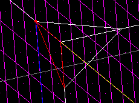
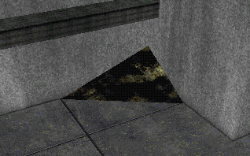

Author:
Sloped Corners  

-----

Author: [JEDMaster](mailto:DeyjaL@AOL.com)  
  
This is another technique for creating sloped surfaces in the corner of
rooms. This method is much more flexible and quicker than previous
methods. Simply take the corner of your sector and cleave the corners
off of all three surfaces that meet there, as shown:

Now, merge the cleaved off portions into a single surface. Presto\!

