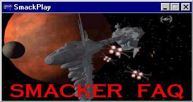
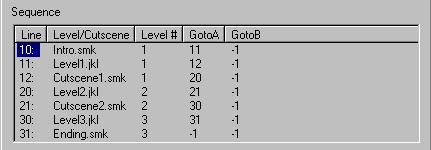

Author:  
  
Author: [Craig "UggBoot" Urquhart](mailto:ugg@darkjedi.com)

  

-----

  
**What is Smacker?**  
Smacker is by far the most popular codec (compression / decompression
software) used to make video game cutscenes. It is used by *Jedi Knight*
and over 900 other video games.  
  
**What are cutscenes?**  
These are the video clips you see between levels in *Jedi Knight* and
*Mysteries of the Sith*.  
  
**Can I use Smacker to make cutscenes for *Mysteries of the Sith*?**  
No, only *Jedi Knight* uses Smacker, *Mysteries of the Sith* uses LEC's
own software. Even though those cutscenes were made as levels, they are
still just videos. They are not run by the game engine\!  
  
**Where do I get Smacker?**  
[RAD Game Tools](http://www.radgametools.com/smkmain.htm) are the makers
of Smacker and other multimedia codecs. Smacker files are made with
their freeware program [Smacker Tools (1.5
MB)](http://www.radgametools.com/down/smacker/setup.exe)  
  
**What else do I need?**  
The images (or an AVI movie clip) you want compressed into a Smacker
file, and maybe a sound file to mix in with them. You can render the
images using any 3D animation program, the most popular ones being
TrueSpace and 3D Studio MAX.  
  
**What size rendering window should I use?**  
I recommend 640x300, the size of the Jedi Knight cutscenes. You can have
any size window, but the result will either be off-center or clipped
since *Jedi Knight* places the top left corner at about (0,80) on
640x480 screen.  
  
**What if I don't want to make an animation?**  
The [Star Wars 3D Modelling Alliance](http://www.swma.net/) has over 100
short movie clips to download, just make sure you get the author's
permission before using them in your level. Most are AVI format but a
few are MPEG which Smacker cannot use. Another problem is that all the
clips are smaller than 640x300 and while Smacker can change the window
size, it doesn't resize the graphics.  
  
**Where do I put the Smacker files?**  
In your *Jedi Knight* directory, create a `Resources/Video` directory.
*Jedi Knight* will only look for Smacker files in that directory. Do not
put them in the project directory as JED will include them in the GOB
file, even if they are not used.  
  
**How do I Include Smacker files in a level?**  
Open JED's Episode Editor and in the Sequence List place the cursor
where you want each cutscene to appear, then press *Add*. If you can
make sense of the example list shown below, you should be able to edit
the other fields. Remember to press *Update* before moving to another
line, otherwise your changes will be lost.  
  

  
Figure 1 - Sequence List From JED's Episode Editor

  
**Why does Jedi Knight skip a Smacker cutscene?**  
*Jedi Knight* cannot find it. First, make sure the correct Smacker file
is in the `Resources/Video` directory, then compare the file name to the
one listed in JED's Episode Editor.  
  
**Why do I get an error message in *Jedi Knight*?**  
This happens when *Jedi Knight* tries to access a Smacker file from a
GOB file. Move the Smacker file from the project directory to the
`Resources/Video` directory.  
  
**Links**  

|                                                                   |                                                                                                                                                                         |
| ----------------------------------------------------------------- | ----------------------------------------------------------------------------------------------------------------------------------------------------------------------- |
| [TrueSpace](http://www.caligari.com/)                             | TrueSpace is An excellent learning program for 3D modelling. You can download a full version from here - [Truespace v1.04](http://www.pcplus.co.uk/article.asp?ID=8561) |
| [3D Studio Max](http://www.ktx.com/)                              | 3D Studio Max is the industry standard, but is far too expensive for most hobbyists. However, if you want a job as a 3D modeller you had better learn it\!              |
| [Crossroads](http://www.europa.com/~keithr/crossroads/index.html) | Crossroads is freeware and will convert between most graphics file formats. Very useful since TrueSpace 1.04 doesn't support 3D Studio 3DS models.                      |
| [Star Wars 3D Modelling Alliance](http://www.swma.net/)           | Here you can download movie clips and detailed 3DS (3D Studio Max) models of nearly every vehicle, actor and building that appeared in the films.                       |
| [The Comlink](http://outer-rim.net/multimedia/sounds.htm)         | The only place to go when looking for Star Wars sound files, it is easily the largest collection on the internet.                                                       |

  
**Credits**  
I'd like to thank Jonathan Clark and Darkness Falls for their [Smacker
Tutoiral](http://www.jediknight.net/darkfall/jkarts/smacktut.html). It
was very helpful in getting me started with cutscenes and is a good
tutorial in using the Smacker Tools program.  
  

-----
