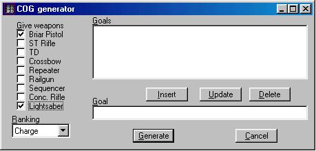

Author:
Single Player Force Powers Tutorial  

-----

Author: Michael Chastant (MikeC)  
  

Adding force powers to a single player level is a two step process:

**1.** In the Episode Editor in Jed look under "Create Startup Cog".
Select the Jedi rank you want for your character and create the startup
cog. This sets what force powers and how many stars are available to
your character.

**2.** Open the startup cog in your favorite text editor. At the end of
the cog you will see a section that reads:

**

timer:

// Force ranking

SetInv(player, 20, 5);

SetInv(player, 14, 4\*50);

jkSyncForcePowers();

Return;

end

In this example it specifies a Jedi rank of 5 (Charge). Directly below
the line that reads *SetInv(player, 14, 4\*50);* add lines saying

SetInv(player, 21, 2.0);

SetInvAvailable(player, 21, 1);

The first number in both lines is the bin number for the force power you
want to add. The second number in the first line represents the number
of stars given to that force power. In this case 2 stars are given to
bin 21, which is Force Jump. Add these lines for each force power you
want the player to have. Only force powers available to that force
ranking can be given, just as with multi player characters. The total
number of stars available is also the same as for a multi player
character of the same level and the most stars that can be given to any
force power is 4.

Here is a list of the bin numbers and the force powers they represent.

|                  |    |                    |    |
| ---------------- | -- | ------------------ | -- |
| Force Jump       | 21 | Force Absorb       | 28 |
| Force Speed      | 22 | Force Protection   | 29 |
| Force Seeing     | 23 | Force Throw        | 30 |
| Force Pull       | 24 | Force Grip         | 31 |
| Force Healing    | 25 | Force Lightning    | 32 |
| Force Persuasion | 26 | Force Destruction  | 33 |
| Force Blinding   | 27 | Force Deadly Sight | 34 |

For Mysteries of the Sith some of the additional bin numbers are:

|                   |    |                       |    |
| ----------------- | -- | --------------------- | -- |
| Force Far Sight   | 35 | Force Push            | 38 |
| Force Projection  | 36 | Force Chain-Lightning | 39 |
| Force Saber Throw | 37 |                       |    |
