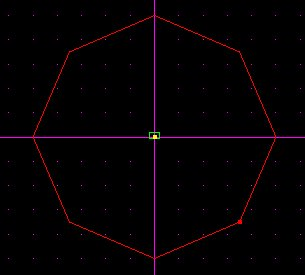
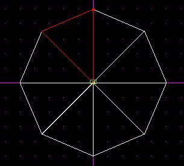
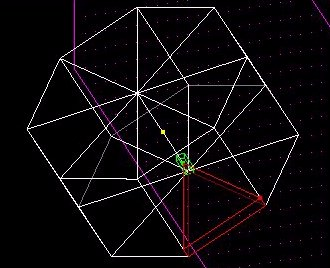
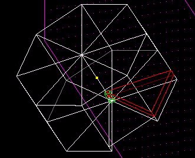
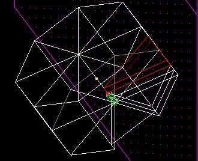
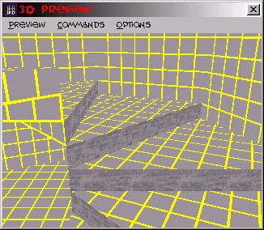

Author: GMS\_Slug

Spiral stairs can look very nice in a level, and despite how it looks,
they're not very hard to make.  
  
We'll be using the default sector. It should be noted that for clarity
in the pictures, I'm using very tall stairs - you'll want to use a
smaller grid step, like .03, for your stairs in an actual level.  
  
In top view, cleave the default sector into a dodecagon (12 sides).. If
you don't want to mess with that, just make an octagon.. (dodecagon just
looks nicer in the finished project.. rounder) Delete all the sectors
but the 12 sided one (or 8 sided)  

  
Now cleave the sector like a pie.. Holding down shift while you cleave
will make the cleave snap to the vertices.  

  
Select one of the newly-formed triangle sectors and go to side view.
Cleave 0.1 off the bottom of it, and delete it. (delete the 0.1 of it,
not the rest of the sector)  

  
Select a sector next to the one you just cleaved and in side view, make
a a sector cleave parallel with the top of the last sector you deleted..
Look at the picture for a better explanation.. Then make another cleave
0.1 above the last one. This will give you a 0.1 tall sector.. Delete
it, and check the 3d preview.. You'll see that you now have two
stairs..  

  
Repeat this process, moving one sector over and cleaving a line parallel
to the top of the last stair, then making a cleave 0.1 above that and
deleting the sector between the two cleaves.  

  
That's it.. You now have, in effect, a spiral staircase.. It doesn't
look real pretty, but this tutor's just for the basics.. You can add a
small pole in the middle of the staircase to make things look nicer, but
that's just some simple sector cleaving and deleting, a technique taught
in many other tutorials, so there's no reason to explain it here :)  
  

