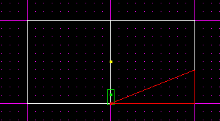
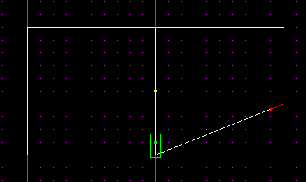
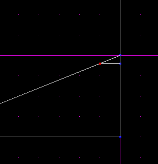
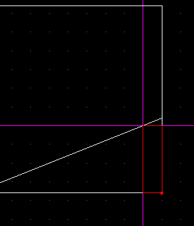
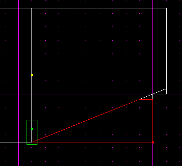
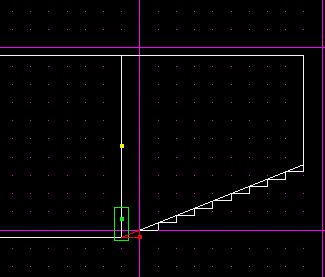
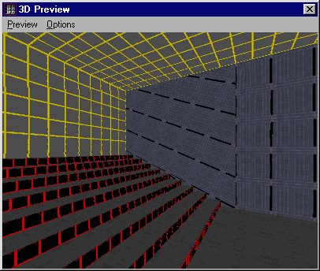

Author: Brian Lozier
  
We will work with the default sector.  
  
First off, staying in top view, cleave the sector in half, from the top
of the screen to the bottom.  
  
Then, switch to the side view by pressing \[shift+2\]. Now, select the
right hand sector, and cleave it diagonally from the bottom left hand
corner, up 2 grid dots on the right side. Please refer to the picture if
you have questions.  
  

  
  
Now, change your grid "snap" to 0.4. This will allow you to make stairs
small enough that the player can actually walk up. It is also a good
idea to change your grid dots to be at 0.1. On to the cleaving\!  
  
Step 1:  
With the triangle sector selected, cleave the top off as shown below.
You will cleave as close as possible to the top corner, without actually
being ON the top corner.  
  

  
  
Step 2:  
Now, switch to vertex mode, and select the bottom left vertex of the
newly formed small triangle. The correct vertex is shown below.  
  

  
  
Step 3:  
Now, with that vertex selected, press \[shift+s\] to align the grid to
it. Then, select the sector underneath the triangle as shown below.  
  

  
  
Step 4:  
  
Now, cleave the sector straight down from the vertex that had been
selected. Refer to the picture below.  
  

  
  
Step 5:  
With the sector above selected, delete it.  
  
Step 6:  
Now, cleave the bottom sector again to create another step.  
  

  
  
Step 7:  
Move back to vertex mode, select the bottom left hand corner vertex, and
again snap the grid to it by pressing \[shift+s\].  
  
Step 8:  
Once again, cleave the sector strait down from that vertex, and delete
it.  
  

  
  
You should be noticing a pattern here. You select the sector, cleave the
step, snap to the lower left hand vertex, align the grid, cleave strait
down, then delete the remaining sector. If you do this till you reach
the bottom of your staircase, you should have something that looks like
this:  
  

  
  
Now, if you texture it up, you have a nice looking stairway going up one
side of your original box.  
  

  
  
Remember to make sure you have all the surfaces that make the steps
flagged to be floor, as described in the Basic Editing Techniques
page.
