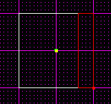
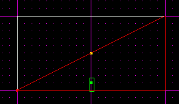
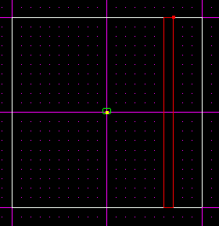
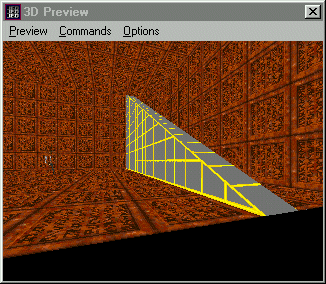
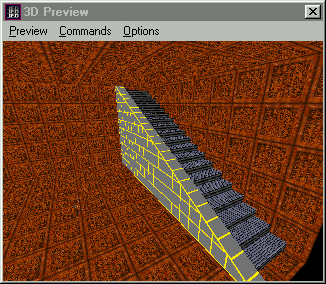
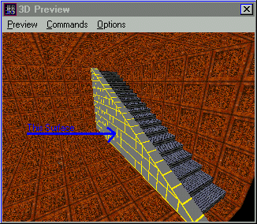
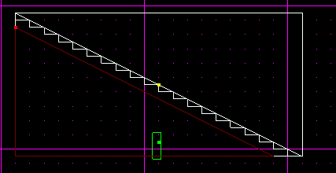
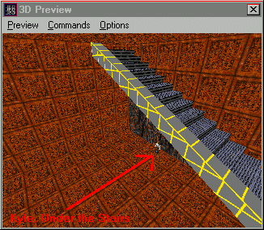

Author:Intermediate Stairs

-----

Author: [Brian Lozier](mailto:lozier@bigfoot.com)  
  
There are a few tutorials out there on the correct way to create stairs.
For a more polished look, however, I suggest you try this tutorial. This
technique will cut down on the amount of sectors, thus raising the
framerate. The stairs also look more polished and realistic. Please read
and understand the original [Stairs
Tutorial](http://massassi.jedinights.com/stairs/stair.htm), or its
little brother, [Basic
Stairs](http://massassi.jedinights.com/stair2/tutor.htm).  
  
We will start with the default sector in Jed. Cleave (from top view) one
side of it off for your stair case. I am using a .1 grid, and a .05 snap
to.  
  

  
Now switch to a side view \[shift+3\], and making sure you are looking
at the long side, cleave diagonally to make an outline for your stairs.
For simplicities' sake, I am just going from the top corner to the
bottom corner.  
  

  
Make sure the bottom sector is selected, go to top view, and cleave the
edge off as shown below. This will create a clean looking rail for the
sides of our steps. We will discuss the method for allowing the player
to walk under the stairs later.  
  

  
Now, with the bottom sector you just cleaved out selected, press the
\[delete\] key. This is the sector you should delete.  
  

  
If you check out your room in 3d preview, you should see a diaganol
railing going all the way up.  
  

  
Now, select the sector next to the railing (the one that is cleaved
diagonally), and create your stairs from it. I will not go over the
stair creation again, just read the old tutorials for info on that. When
you are done with all the cleaving, be sure to delete all the bottom
sectors, and your staircase should look like this:  
  

  
You can already see how many visible sectors this method has eliminated.
It also eliminates a lot of extra surfaces/edges/vertices.  
  
If you would like to be able to walk underneath your stairs, it is very
easy to do. Just select the surface that makes the visible side of the
railing:  
  

  
Then cleave it diagonally along the bottom of the stairs. Make sure to
leave enough room so that the stairs don't extend below the cleave you
are making. This is what the surface should look like after you cleave
it.  
  

  
Now, just extrude \[x\] that surface (you can also use \[shift+x\] to
type in the distance you want it extruded), and you can walk underneath
the staircase. This really cuts down on the sector count, and allows for
better lighting and framerate.  
  

  
As always, if you have questions on this tutorial, or any other Jedi
Knight/Sith related editing questions, feel free to use the [Massassi
Editing Board](http://massassi.jedinights.com/msgboard).  
  

© Copyright 1998 [The Massassi Temple](http://massassi.jedinights.com/)
and [Brian Lozier](mailto:lozier@bigfoot.com).
