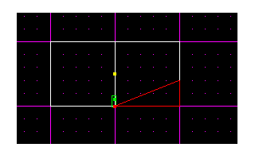
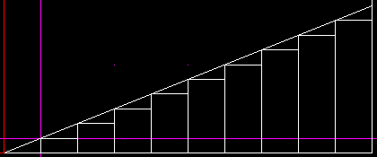
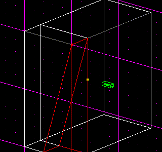
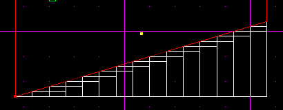
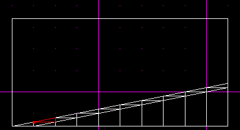
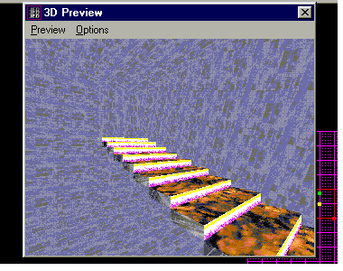

Author: Mark Jones

## Part 1 : Intro

So, you want some stairs? Good Decision\! Stairs add a professional
touch that, unfortunately, not many custom levels released have. First
of all , lets explore what stairways can replace:

Ramps – Who wants a ramp when you can make a nicer looking and just as
effective staircase ?

Elevators – Some levels are filled with elevators that stairs can
replace. The stairs will reduce lag, therefore increasing playability.

Now, lets take a look at some levels with nice examples of stairways. If
you have MOTS, load up the Hutt’s Palace MP level. It is filled with
many differently shaped stairways. Also take note of the spiral stairway
leading to the basement, this is the toughest of stairways to make and
will be covered in a future tutor. Some JK examples of stairs are in the
singleplayer level : Warzone Chapter 1. There are two stairways, one of
them is a simple spiral one. Now , lets load up JED or FB and get to
work\!

## Part 2: Basic Stairway

**Step One:**

Create a new JK or MOTS level.

Cleave the starting box in half horizontally in the overhead view. You
will now have two rectangular sectors. Switch to side mode (keyboard
button 3) and select the sector on the right side. Align its bottom left
vertex with the grid (switch to vertex mode, select the bottom right
vertex, and hit \[shift+s\]) and cleave it up two dots on the default
grid. We are now set up to cleave the stairs in. Make sure you have this
on your screen before proceeding:

**Step Two:**

Next we need to align the bottom right vertex with the grid, and set the
grid to snap in small increments ( I like every .04 ) Okay, we are all
set to begin the process. Make sure to save your work before continuing.

Ready? Cleave horizontally across ONE STEP below the vertex we just
aligned with. This creates a triagle shaped sector. Align the grid with
the bottom left vertex of the triangle and cleave vertically down from
that point. Then cleave horizontally again towards the left. Another
triangle sector is created. Align the bottom left vertex with the grid
once again, and continue the process until you reach the bottom of the
sector. This is what it should look like now:

Okay, we have cleaved up our what was once a one sector rectangle into a
mess of sectors. Now it is time to delete all those extra sectors. So
lets get to work. Delete every one of the rectangular sectors created
when you cleaved vertically.

Presto\! Your first staircase. Texture it up and try it out in JK/MOTS.
It is completely smooth\! No choppy effects when walking on it\!

## Part 3: Advanced Stairs

Okay. You have the stairway concept mastered and you want to continue,
eh? What we will cover here is how to create ‘floating’ stair ways (
ones that can be walked underneath of ). An example of floating stairs
Is the stairwell in Warzone 1 or the stairwell in Hutt’s Palace. In my
opinion floating stairways look much better in some circumstances. Lets
get to work.

Load up Jed, and in the overhead view, cleave a line .4 units to the
right of the left edge. Then switch to view 3 and align the grid with
the bottom left vertex and cleave diagonally up 2 dots. With the rotated
view, you should have this:

**Method 1**

Okay, now lets cleave the stairway up just like we did in part one. But
instead of deleting the entire lower sectors, lets cleave them again
horizontally to leave a small rectangle. This is very hard to describe
in text, so just look at the pic:

**Method 2**

As you see, you need to align every vertex before you cleave each
sector.

If you would like to make stairs without steps underneath (I.E, a smooth
surface) , simply cleave upwards from the bottom left recangle on it's
vertex until you reach the top right rectangle sector. I know this is
confusing, so I included a picture...

Finally, delete the smaller sectors, creating steps, but leave the
larger ones to act as the space to walk under. If you are using method
two, you may merge all the large sectors becuase they will form a convex
shape. **Do this with caution\!**

Texture up the area and it should look something like this:

Excuse the tacky textures, but they provide the best way to see the
different sides of the stairs. :-)

Take note that Kyle has plenty of room to walk under….

That is it for now with stairways!
