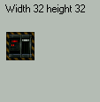
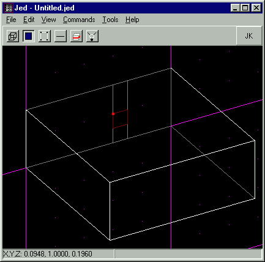
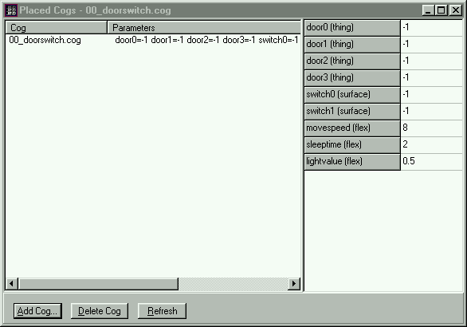
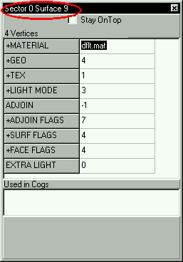
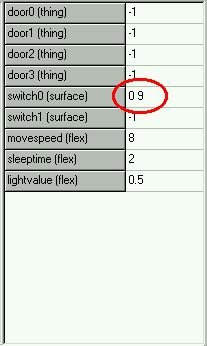

Author:**Switches**

Author: [Mangore Kiramin](mailto:mangore_kiramin@geocities.com)

  

-----

  
Switches play a very large part in Jedi Knight levels, and most good
levels have some. They do various things: open doors, move elevators,
activate traps, and the like. In this tutorial I will go over the basics
of utilizing switches in your levels with the JED editor.  
  
Switches are extremely easy to do.  
  
First off, you need to designate a surface to be your switch. To do
that, it is easiest to cleave a sector wall to create a surface that is
0.1 x 0.1 JKU large. That is the stardard size of a switch texture in
Jedi Knight. However, you should find out how big the switch texture you
wish to use first, and cleave the surface accordingly. To find out how
large a texture is in JKUs, you look at the dimensions of the texture in
the JED resource picker. For example:  
  

The texture shown above is 32x32 pixels.

  
  
Here are the conversions from pixels to JKUs:  
  

|            |         |
| ---------- | ------- |
| Pixels     | JKU     |
| 32 pixels  | 0.1 JKU |
| 64 pixels  | 0.2 JKU |
| 128 pixels | 0.4 JKU |

  
As you will see. Most switches are 32x32 pixels, or 0.1 JKU. Once you
find the dimensions of your switch texture in JKUs, you need to make a
surface that size, by cleaving. That surface should also be 0.1 JKUs
above the ground (no matter how big the switch texture is), because that
will be at eye level with the player.  
  

  
  
You then assign your switch texture to that surface. At this point, it
is necessary to designate that this surface, which you have made into
your switch, will be used in a COG. COGs are explained below, but to do
this, select the surface, go into the item editor, and double click on
"surface flags." From there, just check the box titled, "used in COG."  
  
Now all the basic editing is done. But in order for your switch to
actually DO something, you have to assign it to a COG. A COG is a file
that tells Jedi Knight to carry out certain tasks. Like open a door,
send an elevator to a certain floor, or launch thermal detonators into a
hallway. To assign your switch in a COG, you need to first add that COG
to your level. From the Tools Menu, select "Placed Cogs". This will
bring up the COG window. Next, select "Add Cog..." This will open the
resource picker. You can choose a COG from a list of COGS that came with
Jedi Knight, or you can add one that you put in your project directory.
(That COG must be gobed with your level if it is to work).  
  
Anyway, lets say that I want to make a door that is opened by a switch.
I would scroll through the list of COGs, until I see one named
"00\_doorswitch.cog". I would then add that COG. The COG window will now
look like this:  
  

  
  
You will see that on the right side of the window there is a list of
variables, most currently set to a value of -1. That means no value is
defined for that variable. We will change this. In order for the COG
file to know that the switch has been activated, you must assign it to
one of the variables. In this case, it would be the variable called
"switch0." Select the surface of your switch and look at the item
editor. Along the top it will say a secotor \# and a surface \#. Write
these numbers into the switch0 variable with a space in between, as
shown below.  
  

  
  
You have now created a switch. Whenever that switch is activated, Jedi
Knight will carry out the tasks in the COG. Of course, in this case you
will also need a door and probably a switch on the otherside, whose
surface and sector \#'s you would enter for the variable "switch1." You
would need to assign the door's Thing \# to one of the door variables in
your COG. (Or in the case of an elevator: the elevator's Thing \#)  
  
For more information on how to create doors and elevators, refer to the
following tutorials:  

  - [Basic Doors](http://www.jedinights.com/massassi/doors/tutor.htm)
  - [Basic Elevators](http://www.jedinights.com/massassi/elev/tutor.htm)

  
Note: For switched elevators, a good cog is 00\_elev\_switch.cog  
  
Send questions or comments to:  
[Mangore Kiramin](mailto:mangore_kiramin@geocities.com)  
mangore\_kiramin@geocities.com
