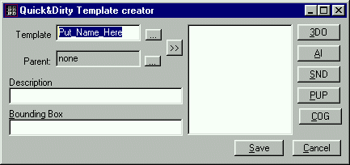
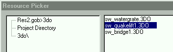
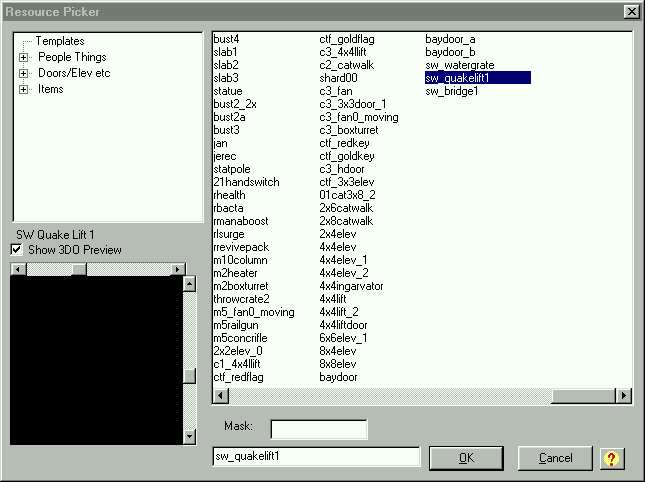

Author:
Templates  

-----

Author: [Brian Lozier](mailto:brian@massassi.net)  
  

In Jedi Knight and Mysteries of the Sith (JK and MotS), there are things
called 3do's. 3do's are explained in detail in the [Basic
Editing](/basics/) lessons. Once you know what a 3do is, and what it's
used for, you may want to create your own. You can follow the [3do
Creation](/tutorials/3do/) tutorial for instructions on that. Once you
have completed your 3do, you must make a template for it.

The template file has many uses. In very basic terms, it gives a name
for each 3do and defines how it acts in-game. What does this mean? Well,
templates can assign flags to each entry, and depending on the flags,
the 3do's act differently. You can set them so you can walk on the 3do,
make it metal, make it "throwable," etc. Fortunately, you don't have to
assign flags to each entry. When JK was created, the team used what are
called "parent templates." These are just template entries that have all
commonly used flags. You can choose to either add the flags, or use a
parent template. I have never manually added the flags, as the parent
templates are great for anything you would want to do. There is a [great
reference](/tutorials/template_reference/) by Slug that talks about all
the parent templates. The template file also defines things OTHER than
3do's, but that is not covered here.

To emphasize the concept, I will show a small example. First, when you
add an existing JK/MotS 3do to your level, such as a storm trooper or a
chair, you are presented with the resource picker. The names in the
resource picker are the names defined in the template. The actual name
of the .3do file doesn't necessarily have to be the same. Here are a few
small examples.

  

    Name:        3do File:       Parent Template:
    My_Chair    my_chair.3do        _walkstruct
    Chair_2     big_chair.3do       _walkstruct

As you can see, the name of the actual file doesn't have to be the same
as the template name. The \_walkstruct parent template allows the player
to walk on the 3do, makes it solid, and makes it metal. Remember, all
the different parent templates are defined in [Slug's reference
document](/tutorials/template_reference/).

Now on to actually adding your 3do. This is very easy, as JED now has a
great Template Creator. First, create your 3do file, and put it in your
project directory under a seperate folder called \\3do. Your directory
structure should look like this:  

    C:\Jed\current_project\         (Project Directory)
    C:\Jed\current_project\3do\     (Directory for your 3do file)

If you are confused about project directories, take a look at the [Basic
Editing](/basics/) lessons. Once you have placed your 3do file in the
correct directory, open the .jed file that you are going to add the new
template to (it must be in the same project directory as the \\3do
folder).

Go to "Tools" then "Template Creator." You will be presented with the
"quick & dirty" template window. First, fill in the top box with the
name you want your 3do to be called. I generally do not use spaces, and
I suggest you keep the name short and descriptive, with no spaces.

Now, type in a description. This can be very general, and doesn't have
any major restrictions on what you can use. Try to keep it short and
descriptive.

Once you have entered a name and a description for your template, click
on the 3do button and select your 3do.

You will notice that the \#BBOX field has been populated. When you use
JED, there is an option to show things as boxes (View, View Things As,
Boxes). JED uses this \#BBOX entry to calculate how big the box will be
drawn. It has no effect on actual game-play.

There are also other entries. The "size" and "movesize" entries have
been added to the big box in the center. The values of these can be
found (if you're interested) by opening the 3do file in Notepad. They
are the radius of the 3do. If the size and movesize aren't correct, your
level can freeze up (among other things). Don't worry, though, if you
use JED to make your templates, these won't get messed up.

Now its time to select a parent template. These are the entries that
define the flags (such as \_walkstruct, explained above). Read through
[Slug's reference document](/tutorials/template_reference/) to find the
correct one for your 3do. If you leave it blank, your 3do will freeze
the level.

Your template is now completed, but there is another step to take before
it actually shows up in the resource picker. You must go to the
"Commands" menu and press "Reload Templates." This will reload the
template file into JED, thus processing your new entry and making it
available. You can now find your new 3do in the Resource Picker.

There are a few things to remember about adding templates.

  - You cannot add a template to a level unless that level has been
    saved. If you are starting a new level and want to add a template,
    you must save it to a project directory first.
  - If you don't want to make a \\3do folder, you can place the 3do
    directly into your project directory, use the JKTree Plugin (inluded
    with JED), and hopefully it will work.
  - Do not use spaces in any filenames. It may work, but its safest to
    just not use them. Use the underscore (\_) instead.
  - If the 3do is broken, it could show up as a yellow box. Troubleshoot
    your 3do first, especially if you used JED's template creator as
    explained in this tutorial.
  - If your level freezes up as you shoot, this could be because you
    forgot to specify a parent template for your 3do.
  - Your 3do could also freeze up the level if it has solid-color mats.
    This can be remedied by setting the geo of that surface to 3 rather
    than 4.

Removing a Template: Often you will create a 3do, notice that it's not
exactly what you want, and delete it. When this happens, you can remove
the template entry. It won't hurt much if you leave it in, but if you're
like most editors, you like your stuff nice, clean, and efficient.

To remove a template, you must edit the template file by hand. The
template file is a plain text file and can be found in your project
directory. If you haven't previously modified it (by using Template
Creator, or by hand) it may not be there. If you want to modify it
before you've added a template, its best to copy the template file from
the JED directory into your project directory and modify that one.

The files are called:  
****

    JK:     MotS:
    master.tpl  mots.tpl

As with any text file, you can modify it with Wordpad, which is Windows
9x's built in text editor. So, go through My Computer or Windows
Explorer and find you project directory. Once there, double-click on the
correct template file (as listed above). If it opens into wordpad,
great. If not, you will have to choose which program you want to open it
with. Just scroll down and click wordpad. I also suggest you leave that
box checked. If not, you will be prompted to choose wordpad every time.

Now that the template file is open, you can scroll all the way down to
the bottom to find your template. A typical template entry looks similar
to the following string. Remember, depending on names, flags, etc, it
could look different.

  

    # DESC: Door 15x10 1/2 of BayDoor type door
    # BBOX: -0.75 -0.499 -0.034859 0.75 0.499 0.034859
    baydoor_b   _walkstruct   model3d=bayd_b.3do size=0.951508 movesize=0.951508

A lot of these entries should look familiar. The top line is the
description you entered in the Template Creator. The \#BBOX entry is the
automatically generated number that's for JED only. On the bottom line,
you will find the template's name, the parent template, then the name of
the 3do file, its size, movesize, and other flags.

Now is a good time to examine the actual template entry (sometimes you
will need to modify these manually). Anything with a \# in front of it
is ignored by JK/MotS. The top line is just for us humans, and the
second line is created by JED, for JED. So, the only really important
line is the bottom line.

Anyway, just highlight the entire 3 lines, and delete it. Once that is
done, save the file. You will be prompted to choose what format you
would like to save in (in wordpad only). Choose "Text Document" -- you
have now deleted a template entry. Feel free to close out Wordpad and go
back to JED.

If your level was open at the time you were modifying the template file,
you must again reload the template file (because you modified it) by
going to "Commands, Reload Templates."

Some things to remember:

  - Always back up your template file before modifying it. If you
    forget, you can always extract it from the JED zip file.
  - If the template is longer than the one in the example, you still
    must delete everything for it to work correctly.
  - If you change the actual 3do file that your template is referencing,
    but keep the same filename, you must delete the template, or at
    least create a new one. This assures that the \#BBOX, size, and
    movesize are correct.

As always, feel free to ask questions on the [message
board](http://forums.massassi.net) if you need more help.
