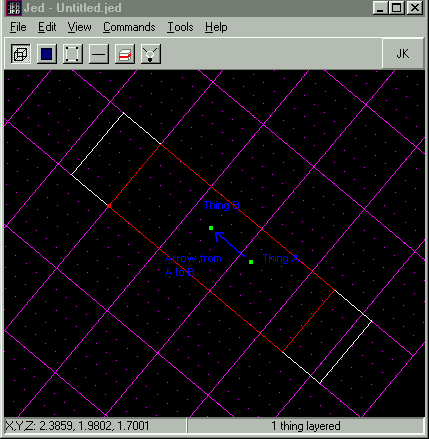
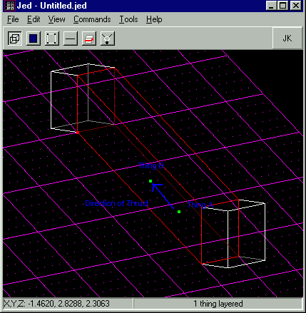
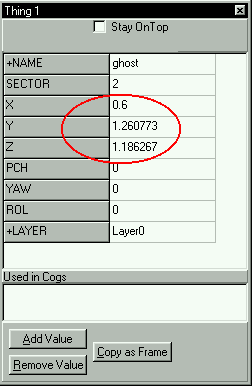
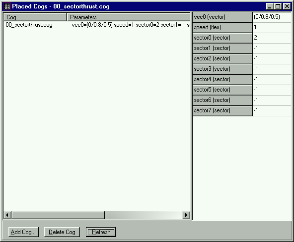

Author: Mangore Kiraman

Sector Thrust is one of the most fun things you can put in a level for
Jedi Knight. However, at times they can be a little mind boggling\!\!\!
Especially for those of you who haven't dealt with vectors in math
classes before. I will write this tutorial in a way that people who
haven't taken calculus and trigonometry can understand. However, along
the way, text written in <span class="tutorial-blue">blue</span> is for
those of you who do know about vector addition and subtraction.  
  
Here we go.  
  
First off, you make the sector that will have thrust. You also need to
make sure that "Used in COG" and "Has Thrust" are checked in the Sector
Flags. Now it is time to work with cogs and math. In the tools menu,
select "Placed Cogs" in order to bring up the cog window. Then click
"Add Cog...", scroll through the list until you see
"00\_sectorthrust.cog" and add it.  
  
The Cog window will now look like this...  


Along the right side of the window is a list of values that you must
define for the cog. You will see:  

<div class="tutorial-table" markdown=1>

|         |                                                                |
| ------- | -------------------------------------------------------------- |
| Vec0    | This is the vector that designates the direction of the thrust |
| Speed   | This is how fast the thrust moves things.                      |
| SectorX | This is the thrusting sector.                                  |

</div>
  
You can have up to eight sectors in one cog, though they all must move
with the same dirrection and speed.  
  
First off, enter the Sector \# from the Item Editor into the sector0
value (do this for all the sectors you want to have thrust). Now on to
the vector... this is where it gets tricky. You'll have to pay
attention, and you will need some scratch paper and a calculator (unless
you can do sqaure roots in you're head). The Windows Calculator is fine
for this.  
  
Note: You can avoid all the complicated math if your thrust is moving
along just one axis. Meaning only in the X, OR Y, OR Z direction. Below
is a list of easy directions. If you don't understand the chart... don't
worry, just continue on through the following steps.  

<div class="tutorial-table" markdown=1>

| DIRECTION          | VALUE    |
| ------------------ | -------- |
| Straight Up (+Z)   | (0/0/1)  |
| Straight Down (-Z) | (0/0/-1) |
| Along +X direction | (1/0/0)  |
| Along -X direction | (-1/0/0) |
| Along +Y direction | (0/1/0)  |
| Along -Y direction | (0/-1/0) |

</div>
  
If you're sector is a simple as this, enter the appropriate value above
for the Vec0 value, and skip down to the section titled "Speed." Most
cases however, involve movement in a 2 or all 3 of these directions at
once. If that is the case you must carry out the following steps:  
  
## DETERMINING THE DIRECTION OF THRUST

**STEP 1:**  *Placing reference things.*  
  
In JED, you must create two Things in your sector. We will call the
first thing, "Thing A," and the second thing, "Thing B." It doesn't
matter what they are, because you will delete them when you are done.
These things must be placed so that IF YOU DREW AN ARROW FROM Thing A TO
Thing B, IT WOULD POINT IN THE DIRECTION OF THE THRUST\!\!\! This
placement can be tricky because we are working in three dimensions. One
of the easiest ways to do it is the following:  
  
This will only work if you have a surface in the sector that is parellel
to the thrust. You would snap the grid to that surface and position your
veiw so you are looking down at the surface. Then insert a thing along
the line of the thrust, as i have show here..  

  
  

  
**STEP 2:** *Get Reference Thing's Coordinates (Position Vectors)*  
  
Now select Thing A and open the Item Editor. Write down its coordinates.
These are the X, Y, Z values. Then do the same for Thing B. (Don't get
them mixed up, or you're thrust will point backwards\!\!\!) It is
alright to round to 2 decimal places... you don't need to have numbers
10 didgets long.  



**STEP 3:** *Find coordinates of direction vector.*  
  
Subtract the X Coordinate of Thing A from the X Coordinate of Thing B
(Call this value X)  
Subtract the Y Coordinate of Thing A from the Y Coordinate of Thing B
(Call this value Y)  
Subtract the Z Coordinate of Thing A from the Z Coordinate of Thing B
(Call this value Z)  
  
so  
  

``` 
    X = (X of Thing B) - (X of Thing A)
    Y = (Y of Thing B) - (Y of Thing A)
    Z = (Z of Thing B) - (Z of Thing A)
```

  
For example. I got these values from my Item Editor:  

**Thing A**

<div class="tutorial-table" markdown=1>

|   |      |
|---|------|
| X | 0.6  |
| Y | 0.61 |
| Z | 0.71 |

</div>

**Thing B**

<div class="tutorial-table" markdown=1>

|   |      |
|---|------|
| X | 0.6  |
| Y | 1.26 |
| Z | 1.19 |

</div>

  
So, after I do the subtraction I get:  
  

``` 
        X  =  0.6 - 0.6  =  0
        Y  =  1.26 - 0.61  =  0.65
        Z  =  1.19 - 0.71  =  0.48
```

  
So once you have your new X, Y, and Z values, you may move on. (Note: If
two of these numbers are zero, you are done with your math. From there,
in the "Vec0" space, enter your numbers in the following format:
(X/Y/Z). If your number ends up something like this: (.67/0/0) you would
replace the ".67" with a "1." If it turned out like that, but with the
non-zero number being negative, you would replace the negative number
with a "-1." After that, skip down to the "Speed" section.) Again, if
you have at least two numbers that are NOT Zero, you must move on to
step 4.  
  
<span class="tutorial-blue">
What we just carried out was vector subtraction. We subtracted the
position vector of Thing A from the position vector of Thing B. This
gave us the displacement vector between the two. This new vector points
in the same direction as the thrust vector, though the magnitude may be
different.  
</span>
  
**STEP 4:** *Calculate magnitude of direction vector.*  
  
Now, take the number you have for X, and multiply it times itself. Write
this number down. Now, do the same thing with both Y and Z. Now, take
those 3 numbers, add them together, and take the square root of the
result.  
  
To get the square root, just enter the number you got from the last
calculation into the calculator, and hit the "sqrt" button. This result
we will call "L."  
  
For example: Mine would be:  
  
(0 \* 0) + (0.65 \* 0.65) + (0.48 \* 0.48)  
  
<span class="tutorial-red">
Remember to do the multiplication BEFORE the addition, or it will not
work correctly
</span>
  
Then, as stated above, I take the result of the above calculations,
0.65, and enter it into my calculator. Then I press the "sqrt" button,
and end up with the following number: 0.81 (again, remember to round to
the the nearest 2 decimal places). Now, I take this number, designate it
as "L," and move on to the next step.  
  
**STEP 5:** *Find coordinates of thrust vector. (Divide coordinates by magnitude to find unit vector)*  
  
Now divide X, Y, Z by L.  

``` 
        X coordinate of thrust vector  =  X / L
        Y coordinate of thrust vector  =  Y / L
        Z coordinate of thrust vector  =  Z / L
```

For example: Mine would be.  

``` 
        X coordinate of vector  =  0 / 0.81  =  0
        Y coordinate of vector  =  0.65 / 0.81  =  0.8
        Z coordinate of vector  =  0.48 / 0.81  =  0.5
```

Those three numbers are the ones you need to tell JED, so write them
down where you wont lose them.  
  
What we just did in the last two steps was turn our displacement vector
into a unit vector (a vector with no length, only a direction). In the
first part we found the magnitude of the displacement vector by taking
the sqaure root of the sum of it's square componets. Then in the second
step we divided each component by the displacement vectors magnitude.
The new coordinates are those of the unit vector of magnitude 1. You
will see if you add up the squares of the unit vector coordinates and
take the sqaure root, that the magnitude is very close to one. Though
not exact because of the rounding we have done.  
  
Rejoice\!\!\! The math is done. (You almost forgot you were learning how
to edit, and thought you were in math class didn't you???) I hope you
made it through that ok. We now have the numbers we need to enter for
the Vec0 value in the cog\! You must write them like this: "(X/Y/Z)"
where X, Y, and Z are the cooridinates the numbers you calculated at the
end of the math section. So I would write: "(0/0.8/0.5)" for Vec0.
(remember NOT to use the "quotes") The hard part is done.  

<span class="tutorial-red">
NOTE: NONE of those three numbers should be LESS than -1 or greater than
1. if they are, you did something wrong. Go back and check you're
work.
</span>
  
## SPEED

Only one thing left. Determine the Speed. At the moment it will be set
at 1. This means that it will move things at a rate of 1 JKU every
second. 1 JKU is equal to 1 large Grid square in JED. So the default
speed is by no means slow. If you wish to move things at a rate of 0.2
JKU / second, then you would change the speed to 0.2. Or if you wanted
it to move at 2 JKU / second then you would put it at 2. In the end you
might want to experiment with different settings to get the speed you
want. You also have to remember that gravity still pulls on things, so
if your thrust is upwards, take that into acount.  
  
Now you are done... hit refresh in the cog window to make sure your
values saved correctly. It will now look like this:  



And finally don't forget to erase the two things you added\! Start up
Jedi Knight and see if it works\! If not you should do the following
things:  
  
1. CHECK YOUR MATH. Most of the time that is the problem.  
2. MAKE SURE YOU HAVE the two flags checked ("Used in COG" and "Has Thrust").  
3. And finally, if all else fails, you can write to me at the e-mail address below.  
  
Happy Editing\!\!\!  
  
*Mangore Kiramin*
  
<span class="tutorial-blue">
The vector you enter for your thrust doesn't have to be a unit vector.
But it is just harder to figure out how fast things will move if it
isn't. Jedi Knight multiplies the magnitude of the vector by the speed
value you give. So both control how powerful the thrust is. If the
magnitude of the vector is 1, you just end up with the power of the
thrust being equal to the speed.
</span>
