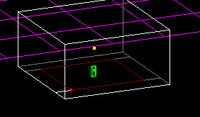
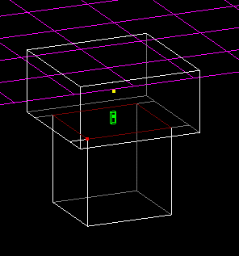
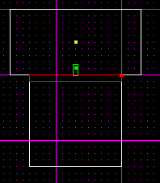
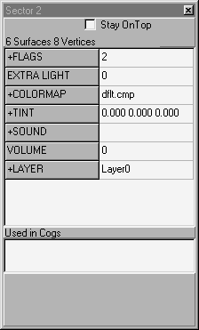
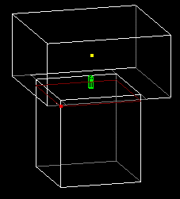
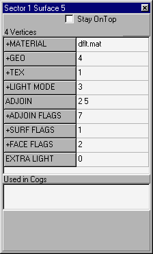

Author: Brian Lozier  
  
Okay, water is VERY easy to do. So we'll jump right in.  
  
1\. Start with the default sector, select the floor (in surface mode),
and cleave a square out of it as shown below.  
  

2\. Now, extrude it.  
  

3\. Okay, the extruded sector is going to be our water, but first, we
want to cleave it a little bit so the water is below ground level. To do
this, switch to a side view, and making sure the correct *sector* is
selected, cleave it like in the following diagram. Make sure not to
cleave it too deep, else the player may not be able to jump out of the
water.  

4\. Now, we have to set the bottom sector to be water, so select it, and
press \[enter\] to invoke the Item Editor. In the "+Flags" section,
enter 2, to designate it "underwater." Or, you can double click and use
the "underwater" checkbox.  
  

5\. Now, if we leave it like this, then the player will look into the
pit, and it will just look like a hole, but if he walks into it, he will
start swimming... and will wonder "what the heck?" So, we have to add a
texture to the surface separating the water from the air. Select the
surface shown below, and choose a water texture for it.  
  

  
6\. Now, that will only take care of ONE side... remember, the person
must see water from above the surface, but also from below the surface.
So, if you press \[shift+f\], it will automatically select the surface
that the original surface is adjoined with. Select a water texture for
that one also.  
  
7\. Now, you will have noticed that a lot of times, level editors choose
to make their water texture "transclucent" which means you can see
through it. There are positive and negative aspects to this. Tranclucent
water looks nice... but, it causes a strain on the computers hardware,
which can cause bad framerates. Generally, if you have a small pool of
water, and it is a multiplayer level, making it transclucent is fine,
but if you have a large pool of water, and are making a multiplayer
level, it is not a good idea. In single player levels, where framerate
isn't as important of a thing, feel free to do whatever you want.  
  
These are just general guidelines, but it's your level, do whatever you
want, just be sure to test it for playability.  
  
That said, the way to make a surface transclucent is to select the
surface, press \[enter\] to invoke the Item Editor, and set the "face
flags" to 2. Or, you can double click on it, and use the checkboxes.
Remember to make both surfaces of the water that way if you are doing
it.  
  
8\. Now, when we extruded and cleaved the sectors, it automatically set
the "GEO" to 0, meaning the surface isn't rendered at all. The player
can walk and see through it. We have to change the geo so the game
renders the surfaces. This way the textures we inputted will show up.  
  
To do this, on both surfaces, switch the "GEO" to 4, as shown below.
Once again, you can also double click and use the radio buttons to
select "draw textured."  

9\. Okay, only a few more steps. You will notice that in most levels,
when you go underwater, everything looks blue. Well, in Jedi Knight,
this is done by tinting the sector a certain color. To do this, select
the sector you want to tint, in our case the water sector, and double
click on the "+tint" field in the Item Editor. This will let you choose
a color to tint your sector.  
  
10\. Now, the last thing we have to do is add the sound. First, select
the underwater sector, and invoke the Item Editor. Then double click on
"+Sounds," pick "00underwater.wav," and set the volume to 1. The volume
ranges between 0, silent, to 1, full sound. You can use any decimal
number (.5, .6, etc) to adjust it to your liking.  
  
On a final note, many people want their water to flow, or push you in a
certain direction. This is done by adding sector thrust to the water
sector. Be sure to check out our sector thrust tutorial, which can be
found in the [tutorials
section](/tutorials.html). Once your water
flows, you may want to make the surface scroll in the same direction --
this will make it *look* like the water is flowing. Once again, check
out the tutorials section for the rivers tutorial.  

