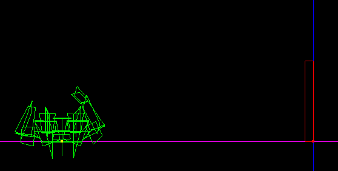
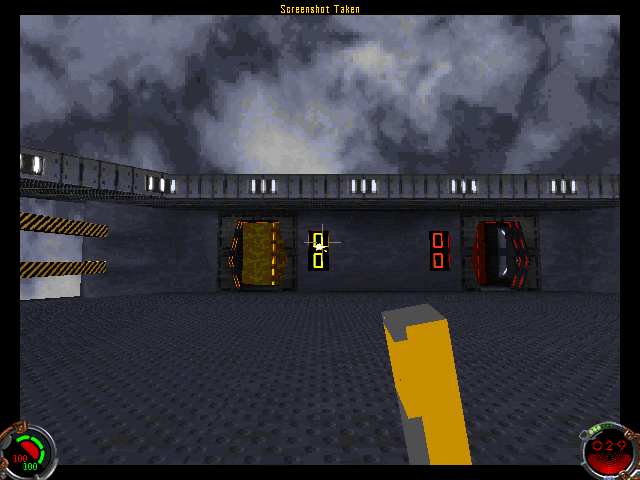
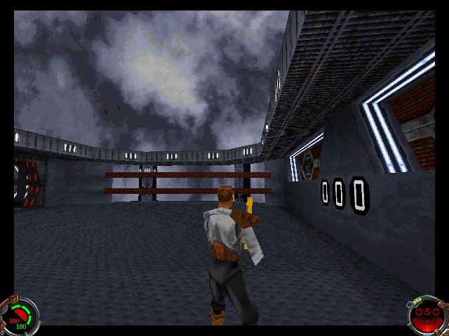

Author: EvanC

  
In this tutorial we will change the model of the bryar weapon, Using
JED. To do this you will need JED 0.81, an ungob program and a text
editor(wordpad is probably best).  
  
Open up res2.gob in your ungob program. Go to the 3do directory and
export bryv.3d0 and bryg.3d0. Now start up JED. Make a simple weapon
model like this:  
  



  
  
Notice how it is compared to the player model? Your weapons should be
about that size. Now what you need to do is make the 3do. Rotate the
sector/model by pressing F9. Make it so that the model points downwards.
Export the model as a 3do called "yourmodel". Using Wordpad open up the
model. About 16 lines down you should see:

    INSERT OFFSET 0 0 0

Change it to:

    INSERT OFFSET  -0.001547   0.009132  -0.000272

Now go down untill you find this:

    MESH 0
    
    NAME yourmodel0
    
    RADIUS   0.081138

  
  
Change it to this:

    MESH 0
    
    NAME K_Rhand
    
    RADIUS   0.081138

Now go to the very bottom of the page and delete the very last line.
Replace it with this:

``` 
     0:  0x0000 0x00001        0       -1      -1        -1             0   0.000000   0.000000   0.000000   0.000000   0.000000   0.000000   0.000000   0.000000   0.000000  K_Rhand
```

Now save your model as bryg.3do, which replaces the old model. Now we
have to make the POV model. This is the one that you see from inside the
player. Open up yourmodel.3do . Again, change the line:

    INSERT OFFSET   0 0 0

into:

    INSERT OFFSET   0.004646   0.021351  -0.011998

Now here is the hardest part. What you will need to do is paste this
into the top of yourmodel.3do, Just below "MESHES 1" :  
  

``` 

MESH 0
NAME K_Rforearm
RADIUS 0
GEOMETRYMODE    4
LIGHTINGMODE    3
TEXTUREMODE 1

VERTICES 0


TEXTURE VERTICES 0


VERTEX NORMALS


FACES 0


FACE NORMALS


MESH 1

NAME K_Rshouldr

RADIUS   0.073759

GEOMETRYMODE    4
LIGHTINGMODE    3
TEXTUREMODE 0


VERTICES 0

TEXTURE VERTICES 0

VERTEX NORMALS

FACES 0

FACE NORMALS
```

Now under that you should see:

    MESH 0
    NAME yourmodel0

Change it to:

    MESH 2
    NAME K_Rhand

Now go up to "MESHES 1" and change it to "MESHES 3" After that you need
to go to the very bottom and delete the bottom line. Replace it with
this:  
  

``` 
     0:  0x0000 0x00001       -1       -1       3        -1             1   0.000000   0.000000   0.000000   0.000000   0.000000   0.000000   0.000000   0.000000   0.000000  $$$DUMMY
     1:  0x0000 0x00001        0        3       2        -1             1   0.012023  -0.000456  -0.032048   0.000000   0.000000   0.000000  -0.000074   0.000000  -0.014126  K_Rforearm
     2:  0x0000 0x00001        2        1      -1        -1             0   0.000886   0.003522  -0.031342   0.000000   0.000000   0.000000  -0.000928   0.000000  -0.005522  K_Rhand
     3:  0x0000 0x00001        1        0       1        -1             1   0.015342  -0.025281   0.041360   0.000000   0.000000   0.000000   0.007833   0.000000  -0.013829  K_Rshouldr
```

  
  
Now go up a few lines untill you see "HIERARCHY NODES 1" Change it to
"HIERARCHY NODES 4". Now save this model as "bryv.3do". Put the models
into your JK/resource/3do directory and run JK. From internal mode you
should see:  
  



  
  
And from external mode you should see:  
  



  
  
As you can probably tell this model doesn't look much like weapon of any
kind. It was made purely for the purpose of this tutorial. For your own
weapons you'd probably want to make a model that's a little bit better
looking than that.  
  
This was part 1 of the weapons tutorial. Part 2 will deal with simple
modifications of the weapon cog to change sounds, projectiles and
more.  
  
NOTE: This method of making weapon 3dos is not the only way.
FIXXER,Pot-head and JonathanC each told me a different way that they
made weapon 3dos. This method is similar to the way LEC probably made
the origanal JK weapons.  
  
Evan C
